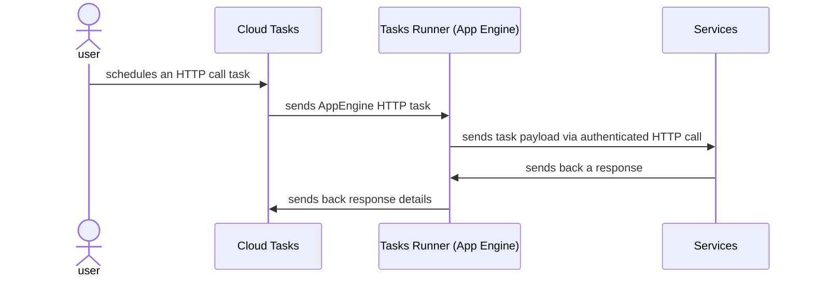

AppEngine HTTP Cloud Tasks Runner
------------------

This repo holds a reusable service for handling long-running HTTP Cloud Tasks that
are meant to be sent to other GCP services such as GCF or Cloud Run which require an active
HTTP connection.

# Prerequisites

- [Python 3.11](https://www.python.org/downloads/release/python-3115/)
- [`gcloud` CLI](https://cloud.google.com/sdk/docs/install)
- [poetry](https://python-poetry.org/docs/1.5/#installation)

# Architecture

The service is an [App Engine][appengine] service that works in pair with
a [Cloud Tasks][cloud-tasks] queue.

This blend is unique for GCP while tasks that are targeting App Engine standard services
with basic scaling can run for up to 24 hours. We're gonna be using this feature to perform
long-running connections to other deployed services that require a live connection
(e.g. Cloud Functions or Cloud Run).

Here's how such long-running requests may look like:

It's obvious that in this schema there is no direct way to notify the `caller` about the
HTTP call status so this part is on the service/caller to identify the result of a call.

E.g. one may supply some callback details in the request payload for the `services` to send a
callback before returning HTTP response to the `tasksRunner`.

[appengine]: https://cloud.google.com/appengine

[cloud-tasks]: https://cloud.google.com/tasks

# Infrastructure and setup

The full setup of the required infrastructure is performed with a helper script
[`setup-env.sh`](./setup-env.sh). The script enables required services, creates App Engine
application, service account, queue and secrets.

After the setup is done one may deploy the service using [`deploy.sh`](./deploy.sh) script.

# Things to improve

Just a couple of things one may want to improve into this service.

1. Add retry policy with some jitter.

   Right now the service will just fail and/or rely on the Cloud Tasks retry policy which may
   not be always a desired behavior. Ideally one should be able to provide customized retry policy
   as part of the request payload and disable Cloud Tasks retries while they are not that universal.

2. Add some well-structured logging.

   No logging support is implemented in the service which may make debugging and diagnostics
   somewhat hard. Ideally one should implement structured logging e.g. using Cloud Logging
   capabilities.

3. Add some tracing support.

   Tracing async executions across multiple services and environments is not the easiest task so
   it's a good idea to have some tracing support available in the service.

4. Have support of callbacks as part of this service.

   It is expected that one will want to get a result of the async call in one or another way.
   The service should provide some capabilities out of the box for doing some simple callbacks
   or have an endpoint that may allow checking up on the status of the execution.
